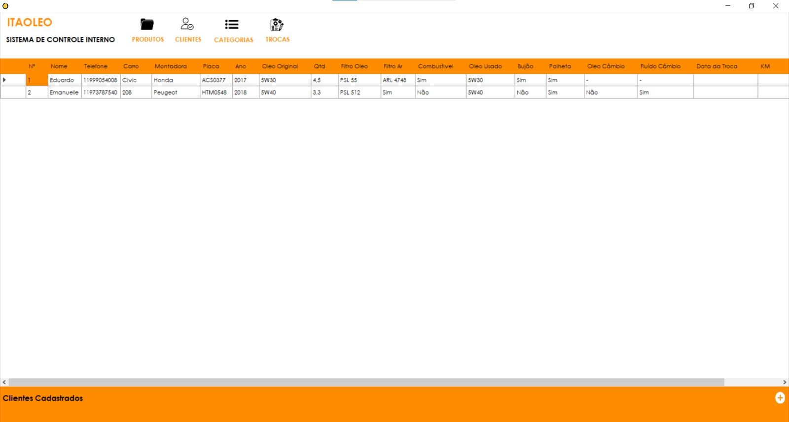
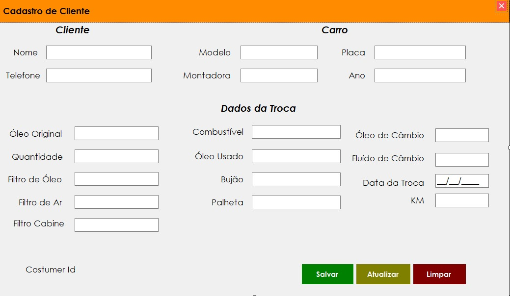

# Sistema Interno de Cadastro de Clientes

## 📌 Funcionalidades

- **Cadastro de Clientes**: Adicione, edite e gerencie informações dos clientes de forma fácil e intuitiva.
- *Cadastro de Produtos**: Registre os produtos adquiridos pelos clientes, incluindo detalhes como nome, descrição e preço.
- **Exclusão de Produtos**: Remova produtos indesejados com facilidade, mantendo o catálogo atualizado.
- **Conexão com Banco de Dados SQL Server**: Utilize um banco de dados SQL Server para armazenar e recuperar dados de clientes e produtos de forma segura e eficiente.
- **Marcação de Trocas**: Ao marcar o checkbox indicando se o produto foi trocado ou não, o sistema automaticamente atualiza o status no banco de dados, facilitando a visualização das trocas realizadas.

## 🎨 Screenshots

    
    

## 💡 Contribuições

Contribuições são bem-vindas! Se você deseja contribuir para este projeto, por favor, faça um fork do repositório e envie um pull request.
